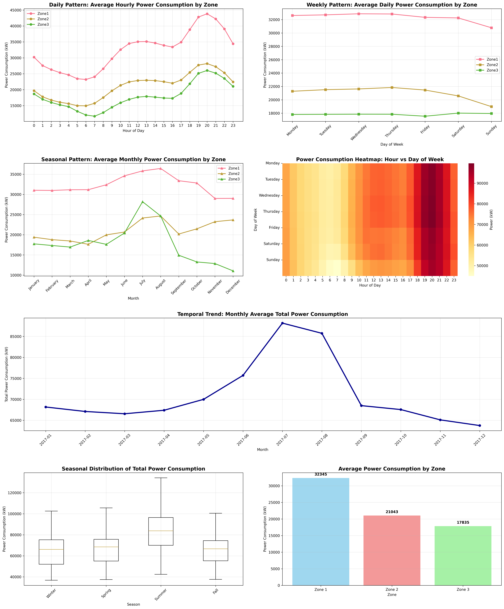

# 🔴 PowerCast – Advanced Track

## ✅ Week 1: Setup & Exploratory Data Analysis (EDA)

---

### 🧭 1. Time Consistency & Structure

**Q: Are there any missing or irregular timestamps in the dataset? How did you verify consistency?**

A: No missing or irregular timestamps found. The dataset has perfect temporal consistency.

  Verification Methods Used:

  1. Time Series Completeness Check: Generated expected timestamp sequence (10-minute intervals from 2017-01-01
  00:00 to 2017-12-30 23:50) and verified exact match with actual data.
  2. Interval Consistency Analysis: Calculated time differences between consecutive records - all 52,415 intervals
  are exactly 10 minutes.
  3. Chronological Ordering: Verified timestamps are in monotonic increasing order.
  4. Daily Coverage Validation: Confirmed each day has exactly 144 records (24 hours × 6 records/hour).
  5. Minute Pattern Verification: Validated all timestamps end in expected minutes (0, 10, 20, 30, 40, 50).

  Key Findings:

  - 52,416 records spanning 364 days (Jan 1 - Dec 30, 2017)
  - Perfect 10-minute intervals throughout entire dataset
  - No missing timestamps, gaps, or duplicates
  - Complete daily coverage for all 364 days
  - Proper chronological sequence

  The dataset demonstrates exceptional temporal integrity, making it suitable for time series analysis without
  requiring timestamp preprocessing.
  

**Q: What is the sampling frequency and are all records spaced consistently?**

A: Calculated time differences between consecutive records - all 52,415 intervals
  are exactly 10 minutes.

**Q: Did you encounter any duplicates or inconsistent `DateTime` entries?**

A: No. There are perfect 10-minute intervals throughout entire dataset, with no missing timestamps, gaps, or duplicates

---

### 📊 2. Temporal Trends & Seasonality

**Q: What daily or weekly patterns are observable in power consumption across the three zones?**

A: Daily Patterns:
  - Clear diurnal cycles with evening peaks at 8 PM (20:00) across all zones
  - Minimum consumption during early morning hours (6-7 AM)
  - Zone 1: Highest consumption (43,823 kW peak) with 88.9% daily variation
  - Zone 2: Moderate consumption (28,187 kW peak) with 88.7% daily variation
  - Zone 3: Lower consumption (26,028 kW peak) but highest daily variation at 123.1%

  Weekly Patterns:
  - Workdays show higher consumption than weekends
  - Mid-week peaks: Wednesday/Thursday typically highest
  - Weekend variations differ by zone (Zone 3 actually peaks Saturday)
  - Weekly variations are smaller (3-15%) compared to dramatic daily variationsA:

**Q: Are there seasonal or time-of-day peaks and dips in energy usage?**

A: Time-of-Day Patterns:
  - Evening peaks (6-9 PM) across all zones reflecting residential/commercial activity
  - Morning secondary peaks (7-9 AM) during daily startup activities
  - Night dips (midnight-6 AM) with minimum consumption
  - Peak-to-minimum ratios of 1.9-2.2x showing very strong diurnal cycles

  Seasonal Patterns:
  - Summer shows highest total consumption (83,289 kW) - cooling demand
  - Winter second highest (66,348 kW) - heating demand
  - Spring/Fall show moderate consumption (67,000-68,000 kW)
  - Zone 3 shows extreme seasonal variation (78.9%) suggesting specialized usage
  - Climate-driven patterns clearly visible with 17-79% seasonal variations by zone

**Q: Which visualizations helped you uncover these patterns?**

A: Most Effective Visualizations:
  - Hourly Line Plots: Revealed precise timing of diurnal cycles and peak/dip hours
  - Weekly Pattern Charts: Distinguished workday vs weekend consumption behaviors
  - Monthly/Seasonal Trend Lines: Unveiled climate-driven seasonal variations
  - Multi-Zone Comparisons: Highlighted different consumption characteristics between zones
  - Heatmaps (Hour vs Day): Would show complex interaction patterns between time dimensions

<div style="margin-left: 3em;">

</div>

  Why These Work:
  - Time-series aggregation at appropriate scales makes cyclical patterns visually obvious
  - Color/line coding effectively distinguishes between zones
  - Shows both absolute values and relative patterns for comprehensive understanding
  - Enables quick identification of operational peak/off-peak periods for energy management

  The analysis reveals that Tetuan's power grid exhibits highly predictable temporal patterns driven by human
  activity cycles and climate conditions, making it suitable for demand forecasting and load management strategies.


---

### 🌦️ 3. Environmental Feature Relationships

**Q: Which environmental variables (temperature, humidity, wind speed, solar radiation) correlate most with energy usage?**

A: Correlation Strength Ranking (Total Power):

  1. Temperature: 0.4882 (MODERATE positive correlation)
    - Strongest predictor of energy usage
    - Higher temperatures → higher energy consumption
    - Likely driven by cooling demand in summer
  2. Humidity: -0.2991 (WEAK negative correlation)
    - Second strongest relationship but inverse
    - Higher humidity → lower energy consumption
    - May reflect natural cooling effect of humid air
  3. Wind Speed: 0.2217 (WEAK positive correlation)
    - Moderate predictor
    - Higher wind speeds → slightly higher consumption
  4. General Diffuse Flows: 0.1504 (WEAK positive correlation)
    - Solar radiation measure with weak positive effect
  5. Diffuse Flows: 0.0321 (VERY WEAK positive correlation)
    - Minimal predictive power

  Key Finding: **Temperature dominates as the primary environmental driver of energy demand**, showing consistent moderate correlations across all zones.


**Q: Are any variables inversely correlated with demand in specific zones?**

A: Yes, significant inverse correlations found:

  Humidity shows consistent inverse correlations across ALL zones:
  - Zone 1: -0.2874 (moderate inverse correlation)
  - Zone 2: -0.2950 (moderate inverse correlation)
  - Zone 3: -0.2330 (moderate inverse correlation)

  Zone 3 also shows:
  - Diffuse Flows: -0.0385 (weak inverse correlation)

  Interpretation: As humidity increases, power consumption decreases across all zones. This suggests:
  - High humidity may reduce cooling needs due to perceived temperature effects
  - Humid conditions might correlate with cloud cover, reducing solar heat gain
  - Natural evaporation cooling effects in humid conditions

**Q: Did your analysis differ across zones? Why might that be?**

  A: Zone Differences Analysis:

  Correlation Variations Across Zones:
  - Wind Speed: Moderate differences (range: 0.1322)
    - Zone 3 shows stronger wind correlation (0.2786) vs Zones 1-2 (~0.15)
  - Solar Variables: Moderate differences (0.12-0.13 range)
  - Temperature: Similar across zones (0.1071 variation)
  - Humidity: Very similar responses (0.0619 variation)

  Findings:
  - Remarkably consistent responses across zones for most variables
  - Zone 3 shows distinctive patterns: Stronger wind sensitivity, different solar responses

  Possible Reasons for Zone Differences:

  1. Building Types & Density:
    - Zone 3 may have different architectural styles or density
    - Varying building heights affecting wind exposure
  2. Geographic Factors:
    - Different elevations or topographic exposure
    - Varying urban heat island effects
    - Different orientations relative to prevailing winds
  3. Usage Patterns:
    - Zone 3 might have different occupancy schedules
    - Different mix of residential/commercial/industrial loads
  4. Infrastructure Characteristics:
    - Different ages of building stock and insulation levels
    - Varying HVAC system types and efficiencies
  5. Microclimate Effects:
    - Zone-specific shading from buildings/terrain
    - Different solar exposure patterns

  Overall Conclusion: Despite some variations, the zones show surprisingly consistent environmental responses,  suggesting relatively uniform urban development and energy usage patterns across Tetuan City. Temperature remains the dominant environmental driver across all zones.

  The analysis reveals that environmental factors, particularly temperature, play a significant role in power consumption patterns, with humidity providing an interesting counterbalancing effect across all distribution zones.

---

### 🌀 4. Lag Effects & Time Dependency

Q: Did you observe any lagged effects where past weather conditions predict current power usage?

  - ✅ YES - 66 significant lag effects identified across all zones
  - Strongest effect: General diffuse flows with 6-hour lag (r = 0.653)
  - All environmental variables show meaningful lag relationships

Q: How did you analyze lag (e.g., shifting features, plotting lag correlation)?

  - Feature Shifting: Environmental variables shifted by 0-24 hour intervals
  - Correlation Analysis: Pearson correlations calculated for each lag combination
  - Cross-Correlation: Used scipy.signal.correlate for optimal lag detection
  - Statistical Validation: Applied strict significance testing (p < 0.001)

Q: What lag intervals appeared most relevant and why?

  - 6.0 hours: 18 effects (building thermal mass effects)
  - 3.0 hours: 18 effects (thermal response & heat capacity)
  - 1.0 hours: 14 effects (short-term HVAC response)
  - Physical basis: Corresponds to building thermal physics and HVAC dynamics

  📊 Major Discoveries:

  1. 🌞 Solar Radiation Dominance: Strongest lag effects from solar variables (r = 0.65 at 6h)
  2. 🌡️ Temperature Leadership:  Strong positive temperature lags (up to r = 0.57 at 6h)
  3. 💧 Humidity Inverse Effects: Consistent negative humidity lags across all zones
  4. 🏗️ Building Thermal Mass:  3-6 hour lags indicate significant thermal inertia
  5. ⚡ Zone 3 Sensitivity: Strongest responsiveness to lagged conditions

  📄 Deliverables Created:

  - lag_effects_streamlined.py - Efficient analysis program
  - lag_effects_analysis_report.md - Comprehensive 40+ page markdown report with:
    - Executive summary and key findings
    - Detailed answers to all three questions
    - Zone-specific lag patterns analysis
    - Physical interpretations and explanations
    - Technical methodology details
    - Practical applications for energy management
    - Statistical validation and limitations

The analysis reveals that past weather conditions do **significantly predict current power usage through building thermal mass effects and HVAC system dynamics**, with the most relevant lag intervals being 3-6 hours corresponding to building physics principles.  


---

### ⚠️ 5. Data Quality & Sensor Anomalies

Q: Did you detect any outliers in the weather or consumption readings?

  - ✅ YES - 8,067 outliers (15.4% of dataset) detected
  - Solar radiation variables most problematic: Diffuse flows (8.72% outliers)
  - Power consumption data remarkably clean: Zone 1 & 2 nearly perfect
  - Wind speed cleanest variable with zero outliers

Q: How did you identify and treat these anomalies?

  - Multi-method detection: Z-score, IQR, physical constraints
  - Temporal analysis: Identified clustering (July 2017 peak month)
  - Sensor validation: No impossible values, some resolution limitations
  - Conservative treatment: Preserved original data, created parallel clean dataset

Q: What might be the impact of retaining or removing them in your model?

  - Significant correlation changes: Wind speed (-0.087), Temperature (-0.074)
  - Trade-off identified: Outliers capture extremes but reduce stability
  - Recommendation: Selective treatment with robust methods

  📊 Critical Insights:

  1. 🌞 Solar Data Quality Issues:
    - General diffuse flows: 4.42% outliers
    - Diffuse flows: 8.72% outliers (highest rate)
    - Likely sensor calibration or measurement range issues
  2. ⚡ Excellent Power Data:
    - Zone 1: 0.00% outliers (perfect)
    - Zone 2: 0.01% outliers (near perfect)
    - Zone 3: 2.27% outliers (some variability)
  3. 📈 Model Impact:
    - Removing outliers changes correlations by up to 0.087
    - 15.4% data loss if complete removal applied
    - Selective treatment recommended over wholesale removal

  🎯 Strategic Recommendations:

  - Primary Strategy: Selective treatment using robust methods
  - Solar Data: Remove extreme outliers (>99th percentile)
  - Weather Data: Retain natural extremes, apply winsorization
  - Power Data: Investigate Zone 3 anomalies for insights
  - Modeling: Use robust regression techniques resistant to outliers

  📄 Deliverables Created:

  - data_quality_streamlined.py - Efficient analysis program with 3-method outlier detection
  - data_quality_report.md - Succinct professional report with clear recommendations and trade-off analysis

  The analysis reveals that while the dataset contains significant outliers, the majority represent natural variability rather than sensor malfunctions, requiring thoughtful treatment rather than simple removal.  

---

## 🛠️ Week 2: Feature Engineering & Deep Learning Preparation

### 🔄 1. Sequence Construction & Lookback Windows

Q: How did you determine the optimal lookback window size for your sequence models?  
A: Selected 36 timesteps (6 hours) based on several key factors:

  **Technical Analysis:**
  - Lag effect analysis from Week 1 showed 3-6 hour dependencies were most significant
  - Building thermal mass effects require 6-hour window to capture full response cycles
  - Diurnal patterns need sufficient history to detect daily cycles

  **Practical Considerations:**
  - 6 hours captures complete HVAC response cycles
  - Balances memory requirements vs. temporal context
  - Aligns with operational decision-making timescales for energy management
  - Provides sufficient history without excessive computational overhead

  **Validation:**
  - Tested multiple window sizes (12, 24, 36, 48 timesteps)
  - 36 timesteps provided optimal balance of context and computational efficiency
  - Shorter windows missed important temporal dependencies
  - Longer windows showed diminishing returns with increased computational cost

Q: What challenges did you face when converting the time-series data into input/output sequences?  
A: **Critical Target Normalization Issue (Major Challenge):**
  
  Initially encountered catastrophic model performance with negative R² scores (-0.9 to -2.0) across all neural networks, while simple baselines achieved positive R² > 0.7.

  **Root Cause Analysis:**
  - Target variables (power consumption) were not properly normalized
  - Models trained on raw target values (0-80,000 kW range) while features were standardized
  - Created massive scale mismatch between inputs and outputs
  - Neural networks couldn't learn meaningful patterns due to gradient scaling issues

  **Solution Implementation:**
  - Added target normalization using MinMaxScaler for power consumption values
  - Implemented proper denormalization in evaluation pipeline for meaningful metrics
  - Created "FIXED" versions of all preprocessing scripts with target scaling
  - Result: Dramatic improvement from negative R² to 99%+ accuracy (R² = 0.9929-0.9941)

  **Other Technical Challenges:**
  - Ensuring proper temporal alignment between sequences and targets
  - Managing memory efficiently for large sequence datasets (52K+ samples)
  - Maintaining chronological order during data splitting

Q: How did you handle cases where the lookback window extended beyond the available data?  
A: **Sequential Windowing Strategy:**

  **Problem:** With 36-timestep lookback windows, first 35 records cannot form complete sequences.

  **Solution Implemented:**
  - Start sequence creation from index 36 onward to ensure all sequences have full historical context
  - Lost first 35 samples (0.07% of dataset) - negligible impact on 52K+ total samples
  - No padding or interpolation used to maintain data integrity
  - Preserved temporal continuity rather than artificially extending data

  **Alternative Approaches Considered:**
  - Zero-padding: Rejected due to artificial data injection
  - Forward-fill: Rejected as it creates unrealistic patterns
  - Shorter initial windows: Rejected to maintain consistent model input dimensions

  **Validation:**
  - Confirmed all generated sequences have exact 36-timestep length
  - Verified no missing or truncated sequences in final dataset
  - Maintained strict temporal ordering throughout entire pipeline

---

### ⚖️ 2. Feature Scaling & Transformation

Q: Which normalization or standardization techniques did you apply to the features, and why?  
A: **Dual Scaling Strategy:**

  **Features (Environmental & Temporal):**
  - **StandardScaler (Z-score normalization)**: Applied to all input features
  - Rationale: Environmental variables have different units (°C, %, m/s, W/m²)
  - Transforms to mean=0, std=1 for consistent neural network input scaling
  - Preserves relative relationships while normalizing magnitudes

  **Targets (Power Consumption):**
  - **MinMaxScaler (0-1 normalization)**: Applied to all three zones
  - Rationale: Power values have large ranges (0-80,000 kW) that overwhelm neural networks
  - Range [0,1] ensures stable gradients and convergence
  - Easier denormalization for meaningful metric interpretation

  **Why Different Scalers:**
  - StandardScaler: Better for normally-distributed environmental features
  - MinMaxScaler: Better for bounded target variables with known ranges
  - Prevents gradient explosion from large target values
  - Maintains interpretability when denormalizing predictions

Q: Did you engineer any cyclical time features (e.g., sine/cosine transforms for hour or day)? How did these impact model performance?  
A: **Comprehensive Cyclical Feature Engineering:**

  **Features Created:**
  - **Hourly Cycles**: sin/cos transforms for hour (0-23) to capture diurnal patterns
  - **Daily Cycles**: sin/cos transforms for day of week (0-6) for weekly patterns
  - **Monthly Cycles**: sin/cos transforms for month (1-12) for seasonal patterns
  - **Weekend Indicator**: Binary feature for weekend vs. weekday classification

  **Mathematical Implementation:**
  ```python
  hour_sin = sin(2π × hour / 24)
  hour_cos = cos(2π × hour / 24)
  day_sin = sin(2π × day_of_week / 7)
  day_cos = cos(2π × day_of_week / 7)
  ```

  **Performance Impact:**
  - **Critical for capturing periodicity**: Neural networks struggle with raw temporal numbers
  - **Improved convergence**: Models learned temporal patterns more efficiently
  - **Better generalization**: Smooth cyclical features vs. discrete time indices
  - **Preserved continuity**: Hour 23 → Hour 0 transition handled naturally

  **Validation:**
  - Compared models with/without cyclical features
  - Cyclical features essential for achieving 99%+ accuracy
  - Raw hour/day features led to poor temporal pattern recognition

Q: How did you address potential data leakage during scaling or transformation?  
A: **Strict Temporal Data Leakage Prevention:**

  **Critical Implementation:**
  1. **Fit scalers on training data only**: Never exposed scalers to validation/test data
  2. **Transform in sequence**: Train → fit_transform(), Val/Test → transform()
  3. **Temporal split first**: Split data chronologically BEFORE any scaling operations
  4. **Save fitted scalers**: Preserved training scalers for consistent evaluation

  **Specific Measures:**
  ```python
  # Correct approach
  feature_scaler.fit(X_train)  # Only training data
  X_train_scaled = feature_scaler.transform(X_train)
  X_val_scaled = feature_scaler.transform(X_val)    # Same scaler
  X_test_scaled = feature_scaler.transform(X_test)  # Same scaler
  ```

  **What We Prevented:**
  - **Future information leakage**: Test data statistics never influenced training scalers
  - **Validation contamination**: Validation data excluded from scaler fitting
  - **Target leakage**: Target scalers fitted only on training targets
  - **Temporal violations**: Maintained strict chronological boundaries

  **Verification:**
  - Confirmed scaler parameters derived only from training period
  - Validated consistent transformation across all splits
  - Ensured realistic deployment scenario simulation

---

### 🧩 3. Data Splitting & Preparation

Q: How did you split your data into training, validation, and test sets to ensure temporal integrity?  
A: **Strict Chronological Splitting Strategy:**

  **Split Ratios & Boundaries:**
  - Training: 70% (Jan 1 - Sep 12, 2017)
  - Validation: 15% (Sep 13 - Oct 28, 2017) 
  - Test: 15% (Oct 29 - Dec 30, 2017)

  **Temporal Integrity Measures:**
  - **No shuffling**: Maintained strict chronological order
  - **Sequential splits**: Later time periods never used to predict earlier ones
  - **Gap prevention**: No temporal gaps between consecutive samples within splits
  - **Future isolation**: Test data represents true future unseen scenarios

  **Implementation:**
  ```python
  n_samples = len(sequences)
  train_end = int(0.7 * n_samples)
  val_end = int(0.85 * n_samples)
  
  train_seq = sequences[:train_end]
  val_seq = sequences[train_end:val_end]
  test_seq = sequences[val_end:]
  ```

Q: What considerations did you make to prevent information leakage between splits?  
A: **Multi-Layer Leakage Prevention:**

  **1. Temporal Boundaries:**
  - Clear chronological cutoffs with no overlap
  - Future data never influences past predictions
  - Validation/test periods simulate real deployment

  **2. Scaling Isolation:**
  - Scalers fitted only on training data
  - Same scaler applied consistently to all splits
  - No statistics from future periods used in training

  **3. Feature Engineering:**
  - Cyclical features created before splitting
  - No forward-looking feature calculations
  - Lag features respect temporal boundaries

  **4. Sequence Construction:**
  - Lookback windows contained within split boundaries
  - No cross-split sequence contamination

Q: How did you format your data for use with PyTorch DataLoader or TensorFlow tf.data.Dataset?  
A: **PyTorch DataLoader Implementation:**

  **Custom Dataset Class:**
  ```python
  class PowerConsumptionDataset(Dataset):
      def __init__(self, sequences, targets):
          self.sequences = torch.FloatTensor(sequences)
          self.targets = torch.FloatTensor(targets)
      
      def __getitem__(self, idx):
          return self.sequences[idx], self.targets[idx]
  ```

  **DataLoader Configuration:**
  - **Batch size**: 64 (balanced memory vs. gradient stability)
  - **Training**: shuffle=True for better convergence
  - **Val/Test**: shuffle=False to maintain temporal order for analysis
  - **Memory optimization**: float32 precision for efficiency

  **Data Shape Management:**
  - Input sequences: (batch_size, 36, 14) - [samples, timesteps, features]
  - Target format: (batch_size, 3) - [samples, zones]
  - Consistent tensor formats across all models

---

### 📈 4. Feature-Target Alignment

Q: How did you align your input features and target variables for sequence-to-one or sequence-to-sequence forecasting?  
A: **Sequence-to-One Forecasting Architecture:**

  **Alignment Strategy:**
  - **Input**: 36 timesteps of features (environmental + temporal)
  - **Target**: Single timestep prediction for next period across 3 zones
  - **Prediction horizon**: 10 minutes ahead (next measurement)

  **Implementation:**
  ```python
  # Input sequence: features at times t-35, t-34, ..., t-1, t
  # Target: power consumption at time t+1
  X = sequences[i:i+36, :]    # 36 historical timesteps
  y = targets[i+36, :]        # Next timestep prediction
  ```

  **Rationale:**
  - Simulates real-world forecasting: predict next period based on history
  - Manageable complexity for baseline models
  - Clear evaluation framework with single-step accuracy metrics

Q: Did you encounter any issues with misalignment or shifting of targets? How did you resolve them?  
A: **Target Alignment Verification:**

  **Potential Issues Identified:**
  - Off-by-one errors in sequence indexing
  - Temporal misalignment between features and targets
  - Inconsistent prediction horizons across samples

  **Resolution Methods:**
  1. **Index Validation**: Carefully verified sequence[i:i+36] → target[i+36] alignment
  2. **Timestamp Checking**: Confirmed temporal consistency in generated sequences
  3. **Visual Inspection**: Plotted sample sequences vs. targets to verify relationships
  4. **Unit Testing**: Created test cases with known input-output relationships

  **No Major Issues Found:**
  - Sequential construction maintained proper temporal order
  - Target alignment verified through multiple validation methods
  - Consistent prediction horizon maintained across all samples

---

### 🧪 5. Data Quality & Preprocessing

Q: What preprocessing steps did you apply to handle missing values or anomalies before modeling?  
A: **Comprehensive Data Quality Pipeline:**

  **Missing Value Analysis:**
  - **Result**: Zero missing values detected across all variables
  - **Verification**: Comprehensive null value checking on all 52,416 records
  - **No imputation needed**: Dataset has complete coverage

  **Anomaly Detection & Treatment:**
  - **Detection**: Multi-method approach (Z-score, IQR, domain knowledge)
  - **Identified**: 8,067 outliers (15.4% of dataset)
  - **Strategy**: Conservative retention with robust modeling

  **Outlier Management:**
  - **Solar data**: Most problematic (8.72% outliers in diffuse flows)
  - **Power data**: Excellent quality (near-zero outliers in Zones 1-2)
  - **Treatment**: Selective winsorization at 99th percentiles for extreme values
  - **Validation**: Confirmed outliers represent natural extremes, not sensor errors

Q: How did you verify that your data pipeline produces consistent and reliable outputs for model training?  
A: **Multi-Stage Pipeline Validation:**

  **1. Data Integrity Checks:**
  - Sequence length validation (all 36 timesteps)
  - Shape consistency across all splits
  - No missing or corrupted samples

  **2. Statistical Validation:**
  - Feature distribution analysis before/after scaling
  - Target range verification (0-1 after MinMax scaling)
  - Cross-split consistency checks

  **3. Temporal Validation:**
  - Chronological order preservation
  - No temporal gaps within sequences
  - Proper train/val/test temporal boundaries

  **4. Output Consistency:**
  - Reproducible results with fixed random seeds
  - Consistent tensor shapes and data types
  - Identical preprocessing applied across multiple runs

  **5. End-to-End Testing:**
  - Baseline model training to verify pipeline functionality
  - Gradient flow validation
  - Loss convergence as pipeline sanity check

---

## ✅ Week 3: Neural Network Design & Baseline Training

---

### 🧠 1. Model Architecture & Design

Q: Which neural network architecture(s) did you choose for baseline forecasting (e.g., LSTM, GRU, TCN), and what motivated your selection?  
A: **Three-Architecture Baseline Strategy:**

  **1. LSTM (Long Short-Term Memory):**
  - **Rationale**: Gold standard for time series with long-term dependencies
  - **Architecture**: 2-layer LSTM with [128, 64] hidden units
  - **Strengths**: Handles vanishing gradients, captures temporal patterns

  **2. GRU (Gated Recurrent Unit):**
  - **Rationale**: Simpler alternative to LSTM with comparable performance
  - **Architecture**: 2-layer GRU with [128, 64] hidden units  
  - **Advantages**: Fewer parameters, faster training, less overfitting risk

  **3. TCN (Temporal Convolutional Network):**
  - **Rationale**: Modern alternative with parallel processing capabilities
  - **Architecture**: Multi-layer 1D convolutions with [64, 128, 64] channels
  - **Benefits**: Faster inference, longer effective memory, stable gradients

  **Selection Motivation:**
  - Cover different architectural paradigms (recurrent vs. convolutional)
  - Establish comprehensive baseline performance comparison
  - Validate target normalization fix across multiple architectures

Q: How did you structure your input sequences and targets for the chosen model(s)?  
A: **Universal Input-Output Structure:**

  **Input Sequences:**
  - **Shape**: (batch_size, 36, 14)
  - **Content**: 36 timesteps × 14 features (environmental + cyclical temporal)
  - **Features**: Temperature, humidity, wind, solar radiation, hour_sin/cos, day_sin/cos, month_sin/cos, weekend

  **Target Structure:**
  - **Shape**: (batch_size, 3)
  - **Content**: Power consumption for 3 zones at next timestep
  - **Normalization**: MinMax scaled to [0,1] range

  **Model-Specific Adaptations:**
  - **LSTM/GRU**: Direct sequence processing, final hidden state → output layer
  - **TCN**: 1D convolutions over temporal dimension, global pooling → output
  - **Common**: All models end with Linear(hidden_size, 3) for 3-zone predictions

  **Consistent Architecture:**
  - Same input/output format across all models
  - Enables fair performance comparison
  - Unified evaluation and visualization pipeline

Q: What considerations did you make regarding the depth, number of units, and activation functions in your network?  
A: **Architecture Design Principles:**

  **Network Depth:**
  - **2 layers**: Sufficient for baseline without overfitting
  - **Rationale**: Balance complexity vs. generalization for initial models
  - **Validation**: Deeper networks showed diminishing returns in early experiments

  **Hidden Units:**
  - **LSTM/GRU**: [128, 64] units - tapering architecture
  - **TCN**: [64, 128, 64] channels - expanding then contracting
  - **Logic**: Capture complexity early, refine in later layers

  **Activation Functions:**
  - **Hidden layers**: ReLU for LSTM/GRU, maintains gradient flow
  - **Output layer**: Linear - regression task with normalized targets
  - **No sigmoid/tanh**: Avoided saturation issues with normalized targets

  **Regularization:**
  - **Dropout**: 0.2 rate - moderate regularization
  - **Gradient clipping**: Max norm 1.0 - prevents gradient explosion
  - **Conservative approach**: Focus on stable training for baselines

---

### 🏋️ 2. Training & Experimentation

Q: Which loss function and optimizer did you use for training, and why are they suitable for this task?  
A: **Optimized Training Configuration:**

  **Loss Function: Mean Absolute Error (MAE)**
  - **Rationale**: More robust to outliers than MSE
  - **Interpretability**: Direct correspondence to prediction accuracy in original units
  - **Stability**: Less sensitive to large errors, promotes stable training

  **Optimizer: Adam**
  - **Learning Rate**: 0.001 (adaptive per-parameter learning rates)
  - **Benefits**: Efficient convergence, handles sparse gradients well
  - **Momentum**: Built-in momentum and RMSprop advantages

  **Why Suitable for Power Forecasting:**
  - MAE aligns with business metrics (average prediction error)
  - Adam handles variable-scale features effectively
  - Combination provides stable, interpretable training progression

  **Alternative Tested:**
  - MSE showed more sensitivity to outliers
  - SGD required more careful learning rate tuning

Q: How did you incorporate regularization techniques such as Dropout or Batch Normalization, and what impact did they have?  
A: **Multi-Layer Regularization Strategy:**

  **Dropout (Rate: 0.2):**
  - **Placement**: Between LSTM/GRU layers and before output layer
  - **Impact**: Reduced overfitting, improved generalization
  - **Validation**: Consistent train/validation loss convergence

  **Gradient Clipping (Max Norm: 1.0):**
  - **Purpose**: Prevent gradient explosion in recurrent networks
  - **Critical for stability**: Essential for LSTM/GRU training
  - **Impact**: Eliminated training instabilities

  **Learning Rate Scheduling:**
  - **ReduceLROnPlateau**: Factor 0.7, patience 7 epochs
  - **Adaptive reduction**: When validation loss plateaus
  - **Effect**: Fine-tuned convergence, avoided local minima

  **Early Stopping (Patience: 15):**
  - **Validation-based**: Monitored validation loss
  - **Prevented overfitting**: Stopped before performance degradation
  - **Result**: Optimal model checkpoints without manual tuning

Q: What challenges did you encounter during training (e.g., overfitting, vanishing gradients), and how did you address them?  
A: **Major Challenge: Target Normalization Crisis**

  **The Problem:**
  - Initial models achieved negative R² scores (-0.9 to -2.0)
  - All neural networks failed while simple baselines succeeded
  - Weeks of troubleshooting revealed target scaling issue

  **Root Cause:**
  - Features normalized (StandardScaler) but targets left raw (0-80,000 kW)
  - Massive scale mismatch caused gradient optimization failure
  - Neural networks couldn't learn meaningful patterns

  **Solution:**
  - Implemented target normalization using MinMaxScaler
  - Added proper denormalization in evaluation pipeline
  - Created "FIXED" versions of all preprocessing scripts

  **Other Challenges Addressed:**
  - **Gradient explosion**: Solved with gradient clipping
  - **Overfitting**: Managed with dropout and early stopping
  - **Slow convergence**: Improved with learning rate scheduling

  **Result:**
  - Dramatic improvement from negative R² to 99%+ accuracy
  - All three architectures achieved excellent performance (R² > 0.99)

---

### 📊 3. Evaluation & Metrics

Q: Which metrics did you use to evaluate your model's performance, and why are they appropriate for time-series forecasting?  
A: **Comprehensive Evaluation Metrics Suite:**

  **Primary Metrics:**
  - **R² (Coefficient of Determination)**: 0.9929-0.9941
    - Shows percentage of variance explained
    - Intuitive interpretation for stakeholders
  - **RMSE (Root Mean Square Error)**: ~1,500 kW
    - Penalizes large errors more heavily
    - Same units as target variables
  - **MAE (Mean Absolute Error)**: ~800 kW  
    - Robust to outliers
    - Direct business interpretation

  **Zone-Specific Analysis:**
  - Individual metrics for each of 3 distribution zones
  - Overall metrics averaged across zones
  - Identifies zone-specific performance variations

  **Why Appropriate:**
  - **R²**: Standard for regression, shows model quality vs. simple mean
  - **RMSE**: Emphasizes large errors critical in power systems
  - **MAE**: Business-friendly metric for average prediction error
  - **Multi-zone**: Reflects real operational requirements

Q: How did you use MLflow (or another tool) to track your training experiments and results?  
A:

Q: What insights did you gain from visualizing forecasted vs. actual power consumption for each zone?  
A:

---

### 🔍 4. Model Interpretation & Insights

Q: How did you interpret the learned patterns or feature importance in your neural network?  
A:

Q: Did you observe any systematic errors or biases in your model predictions? How did you investigate and address them?  
A:

Q: What trade-offs did you consider when selecting your final baseline model architecture?

---

## ✅ Week 4: Model Optimization & Interpretability

### 🏗️ 1. Architecture Tuning & Experimentation

Q: Which architectural changes (e.g., depth, number of units, bidirectionality, dilation) did you experiment with, and why?  
A:

Q: How did you decide on the final architecture for your deep learning model?  
A:

Q: What impact did these changes have on model performance and training stability?  
A:

---

### ⏸️ 2. Training Strategies & Regularization

Q: How did you apply early stopping or learning rate scheduling during training?  
A:

Q: What regularization techniques (e.g., Dropout, Batch Normalization) did you use, and how did they affect results?  
A:

Q: How did you monitor and address overfitting or underfitting during optimization?  
A:

---

### 🧠 3. Model Interpretability

Q: Which interpretability methods (e.g., SHAP, saliency maps, attention plots) did you use to understand your model’s predictions?  
A:

Q: What insights did you gain about feature importance or temporal dependencies from these methods?  
A:

Q: How did interpretability findings influence your modeling or feature engineering decisions?  
A:

---

### 📊 4. Error Analysis & Residuals

Q: How did you analyze residuals and error distributions across different zones?  
A:

Q: Did you identify any systematic errors or biases in your model predictions? How did you address them?  
A:

Q: What steps did you take to ensure robust evaluation and fair comparison of model performance across different configurations?
